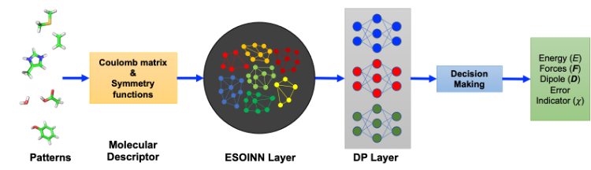
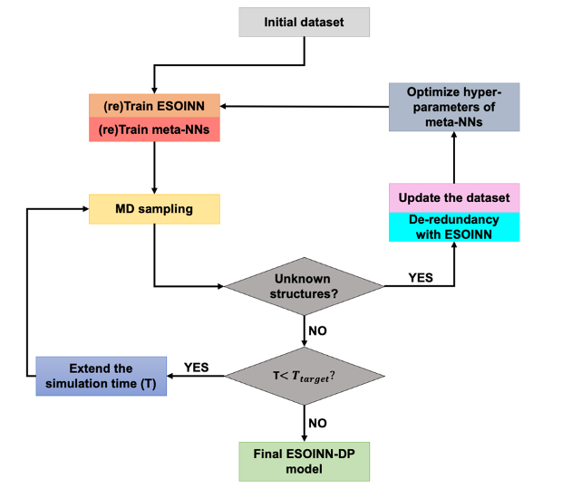
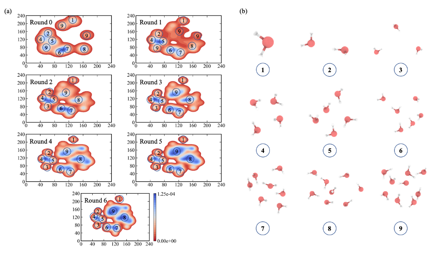
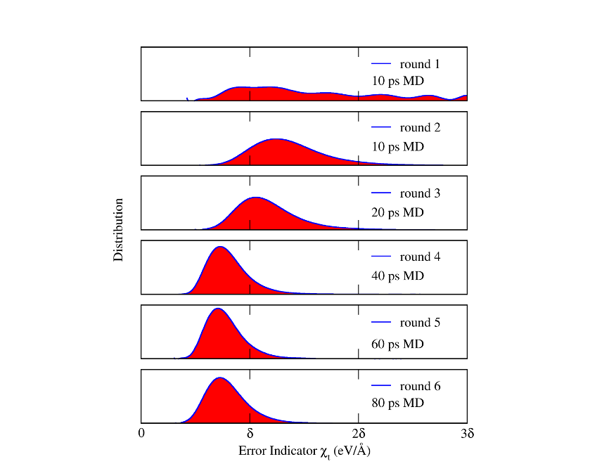

## ESOINN-DP

##Description
an automated NNPES training framework named enhanced self-organizing incremental neural-network deep potential (ESOINN-DP). This method has three important features: (1), the automated construction of the reference dataset that requires little human intervention and with low redundancy. (2), the automated optimization of neural network structures. (3), the self-verification of trained models.
## Basic Workflow

## Prerequisites:
* Anaconda with Python 3.6 and cuda 10.0 
* TensorMol-0.1 (https://github.com/jparkhill/TensorMol) 
* conda create -n esoihdnn python=3.6
* pip –-upgrade install pip

* pip install parmed tensorflow-gpu==1.14
* conda install numpy scipy scikit-learn paramiko matplotlib seaborn
* conda install -c omnia openmm

#Installation of Library and TensorMol

#Installation of ESOI-HDNN-MD
* conda activate esoihdnn
* cd ESOI-HDNN-MD
*  python setup.py install

## Examples:
sample NN-PES for water cluster:

## References
Xu, Mingyuan; Zhu, Tong; Zhang, John ZH (2021): Automated Construction of Neural Network Potential Energy Surface: The Enhanced Self-Organizing Incremental Neural Network Deep Potential Method. ChemRxiv. Preprint. https://doi.org/10.26434/chemrxiv.14370527.v1 
Xu, Mingyuan; Zhu, Tong; Zhang, John ZH (2020): Ab Initio Molecular Dynamics Simulation of Zinc metalloproteins with Enhanced Self-Organizing Incremental High Dimensional Neural Network. ChemRxiv. Preprint. https://doi.org/10.26434/chemrxiv.13207967.v1 
